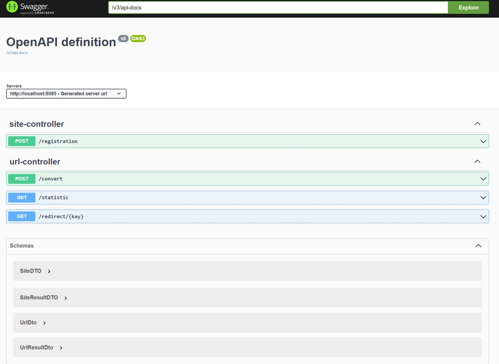

# url_shortcut

## О проекте

**Проект "Сервис - UrlShortCut"**

В проекте реализован функционал сервиса, 
который осуществляет замену ссылок на сайт ссылками на сервис, сервис работает на REST API;

_Контакты для связи:_
__**kbus94@yandex.ru**__

### Для запуска необходимо:
1. [x] Java 17;
2. [x] Maven 3.8.
3. [x] PostgreSql 14.

### Стек используемых технологий:
* Java 17
* Maven 3.8
* Spring 2.7.3
* * Web
* * Data Jpa
* * Security
* * Validation
* * Test
* PostgreSQL 42.5.4
* Liquibase 3.10.3
* Lombok 1.18.26
* Checkstyle
* 

Перед запуском проекта необходимо создать **БД car** и указать
**_login/password_** в файле _src/main/resources/db.properties_;

### Запуск приложения:

+ Cкачать проект из этого репозитория
+ Настроить соединение с базой данных, создать базу данных командой create database urlShortcut
+ Запустить проект командой
```
mvn spring-boot:run
```
### Интерфейс:

#### Регистрация сайта.
Сервисом могут пользоваться разные сайты. Каждому сайту выдается пароль и логин.
Чтобы зарегистрировать сайт, в систему нужно отправить запрос.
```POST /registration```.
C телом JSON объекта: ```{site : "job4j.ru"}```.
Ответ от сервера: ```{registration : true/false, login: УНИКАЛЬНЫЙ_КОД, password : УНИКАЛЬНЫЙ_КОД}```.
Флаг registration указывает, что регистрация выполнена или нет, то есть сайт уже есть в системе.*


#### Авторизация.

Авторизация осуществляется через JWT. Пользователь отправляет POST запрос с login и password и получает ключ.
Этот ключ отправляет в запросе в блоке HEAD.
```Authorization: Bearer ........```.


#### Регистрация URL.
Поле того, как пользователь зарегистрировал свой сайт, он может отправлять на сайт ссылки и получать преобразованные ссылки.
Пример.
Отправляем URL: ```/buslaev```.
Получаем: ```gs$y21&GT$```. Ключ ```gs$y21&GT$``` ассоциирован с URL.
Опишем вызовы: ```POST /convert```.
C телом JSON объекта: ```{url: "https://www.site.ru/buslaev"}```.
Ответ от сервера: ```{code: gs$y21&GT$}```*


#### Переадресация. Выполняется без авторизации.
Когда сайт отправляет ссылку с кодом, в ответ возвращается ассоциированный адрес и статус 302.
Вызовы: ```GET /redirect/УНИКАЛЬНЫЙ_КОД```.
Ответ от сервера в заголовке: ```HTTP CODE - 302 REDIRECT URL```*


#### Статистика.
В сервисе считается количество вызовов каждого адреса.
По сайту можно получить статистку всех адресов и количество вызовов этого адреса.
Вызовы: ```GET /statistic```.
Ответ от сервера JSON: ```{url : "......", total : ......}```*


#### Визуализация ресурсов API.



